<div align="center">

# Fantasy NBA Copilot

**An AI copilot for Yahoo Fantasy Basketball.**
Connect your Yahoo league via OAuth, then chat with an assistant that actually
knows your roster, league rules, projections, schedules, injuries, and every
trade in your league's history.

[](https://github.com/itamarsaacks/fantasy_copilot_v2/actions/workflows/ci.yml)
[](./LICENSE)


<br/>

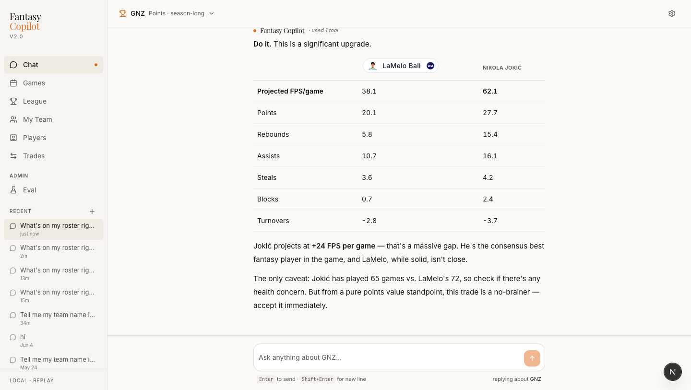

*The chat agent evaluating a real trade against real projection data —
side-by-side stat comparison, +24 FPS delta, verdict.*

</div>

---

## What it does

- **Chat that understands your league** — ask "who should I start tonight",
  "is Sengun on a hot streak", "should I trade Embiid for Jokic", "who was on
  my team on March 8". The agent calls real tools against real data — it
  never estimates a stat.
- **Six tabs**: Chat · Games · League · My Team · Players · Trades + Waivers.
  Every tab has a date toggle for point-in-time views.
- **Point-in-time roster reconstruction** — event-sourced from draft +
  transaction history, so "my team on any past date" replays correctly even
  after mid-season trades.
- **All five Yahoo scoring formats** — Season Points, H2H Points,
  H2H Categories, H2H One Win, Rotisserie.
- **Replay mode** — the entire app can be pinned to a synthetic "today"
  (e.g. `AS_OF_DATE=2026-03-15`) so it works and tests off-season, when
  Yahoo has no live data.

---

## Screenshots

Every screenshot below is real, unstyled, pulled from the app in replay
mode (pinned to March 15, 2026). Nothing is mocked.

### Chat — real tools, real data, real reasoning

The agent never estimates. Every stat comes from a tool call against the
league's own data.

| Roster query with rich formatting | Historical box-score lookup |
|---|---|
| 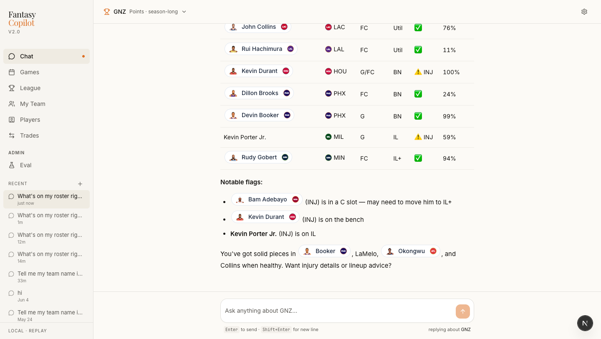 | 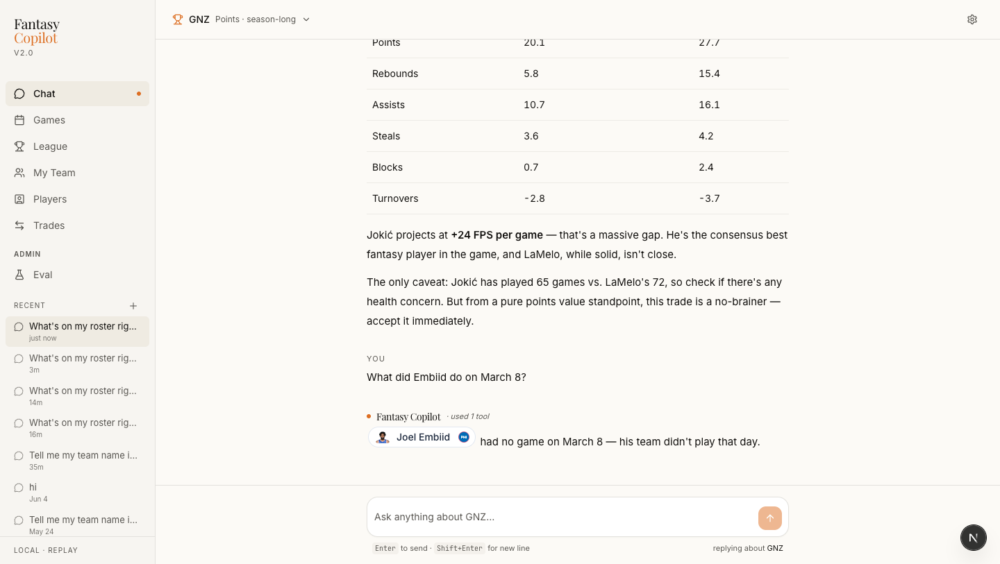 |

### My Team — historical roster reconstruction

Toggling to a past date replays draft + transactions to reconstruct the
roster you actually had on that day, then shows the real box-score line
for each player.

| Today (Mar 15) — current roster | Two days back (Mar 13) — different players, real box scores |
|---|---|
| 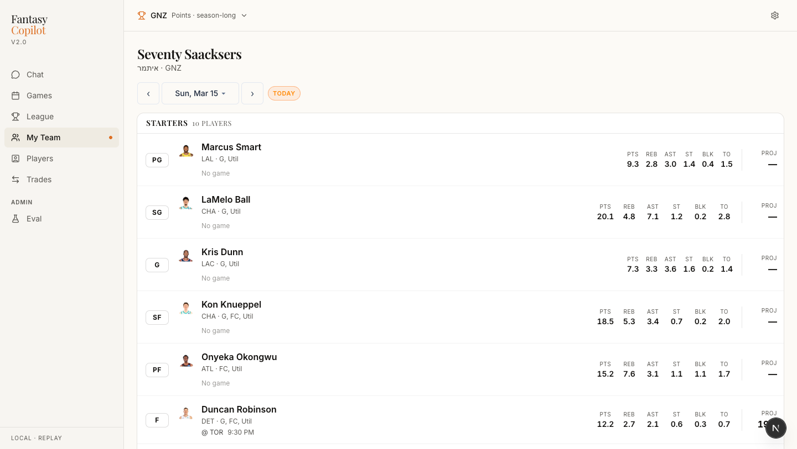 | 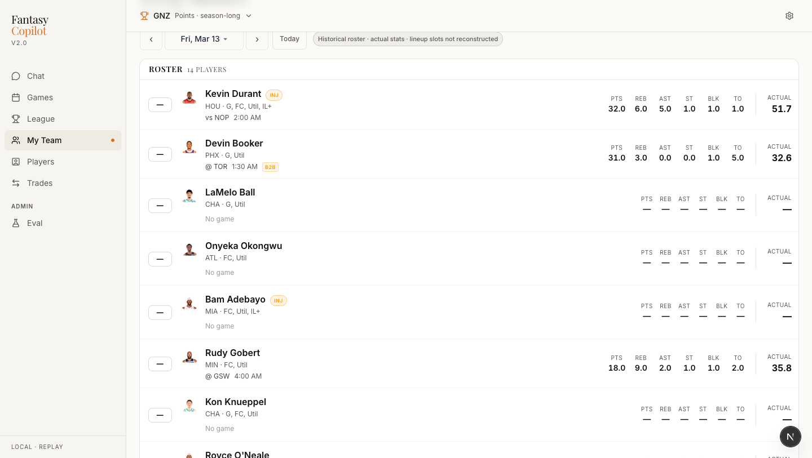 |

### League — per-date standings + opponent inspection

Every team's FPS on any given date, plus a clickable dialog showing what
their roster looked like on that date.

| Standings for Mar 15 (with format-aware status pills) | Any team → per-date roster with per-player FPS |
|---|---|
| 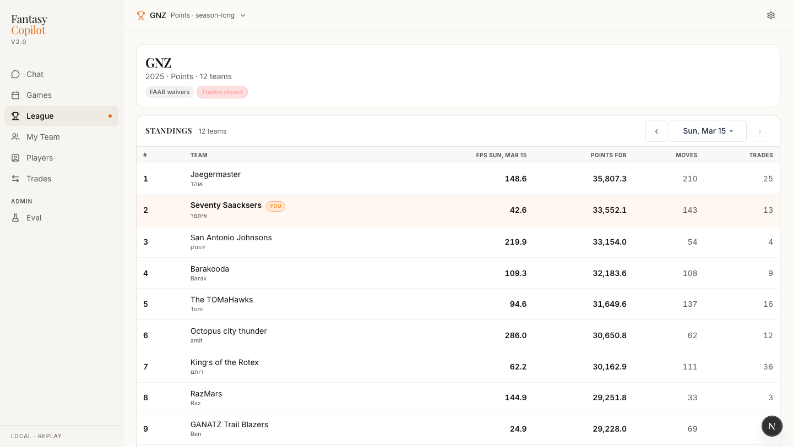 | 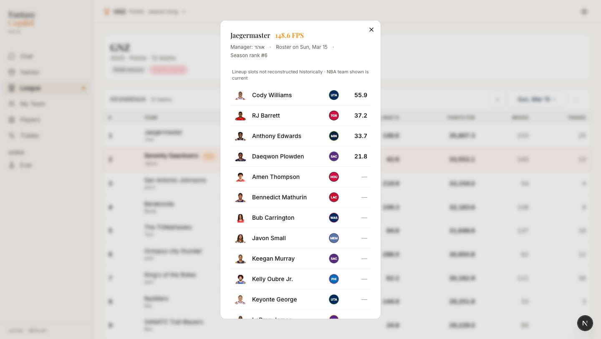 |

### Players — league-wide leaderboard + deep drawer

| Sortable leaderboard across 719 players | Player detail: windowed stats, game log, projections |
|---|---|
| 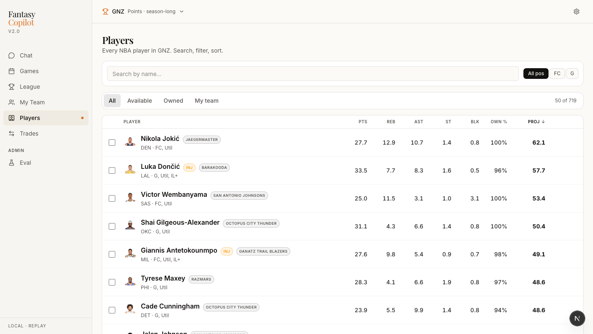 | 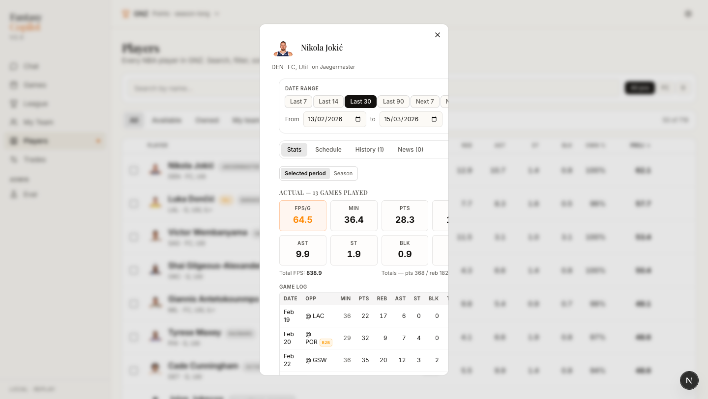 |

### Trades + Waivers — three sub-tabs

| Trade builder — pick partner, pick players, see live delta | Waiver Planner — multi-date calendar → ranked FAs |
|---|---|
| 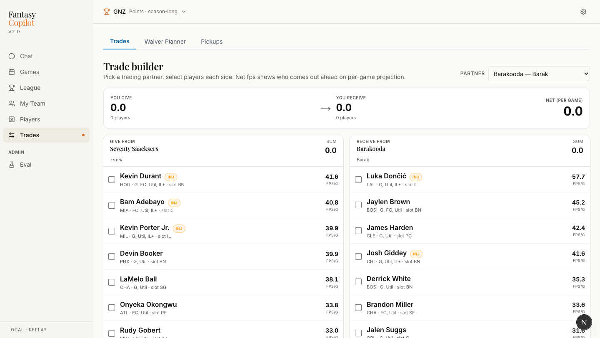 | 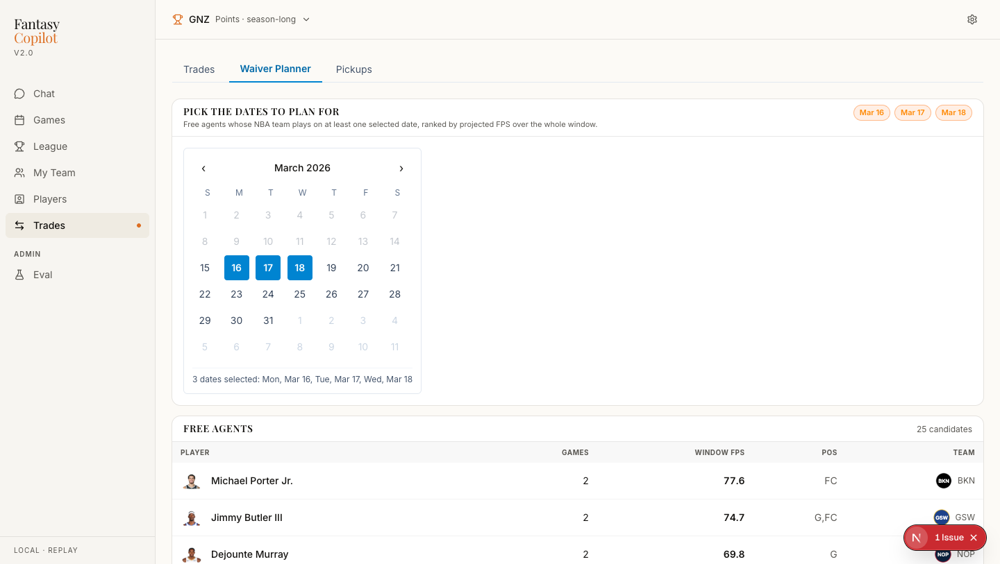 |

### Games — NBA scoreboard for any date

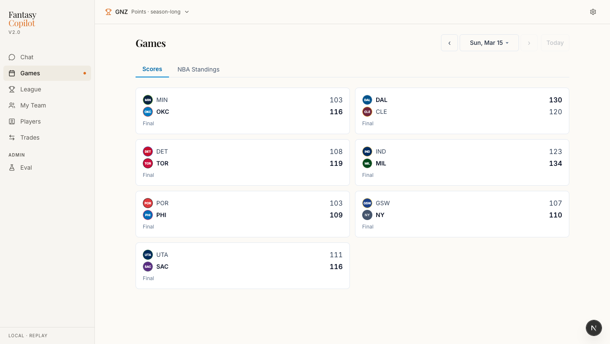

---

## Architecture in a nutshell

```
┌────────────────────────────┐     ┌───────────────────────────────┐
│  Next.js 15 (App Router)   │────▶│  FastAPI + async SQLAlchemy   │
│  React 19 · Tailwind ·     │     │  Anthropic Claude · LangGraph │
│  TanStack Query · shadcn   │◀────│  21 typed agent tools         │
└────────────────────────────┘     └───────────────┬───────────────┘
                                                   │
                            ┌──────────────────────┼─────────────────────┐
                            ▼                      ▼                     ▼
                    ┌──────────────┐      ┌─────────────────┐   ┌───────────────┐
                    │  Postgres 16 │      │  Sync jobs      │   │  Read-only    │
                    │  event log + │◀─────│  (Yahoo, ESPN   │──▶│  connector    │
                    │  projections │      │  schedule, news)│   │  Protocol     │
                    └──────────────┘      └─────────────────┘   └───────────────┘
```

**Load-bearing decisions** (with rationale in [`docs/decisions/`](docs/decisions)):

- **Postgres is the only source of truth at request time.** Yahoo + ESPN are
  background feeders. No live third-party call on any user-facing request.
- **History is reconstructed, not snapshotted.** `roster_at(team_id, date)`
  replays draft + `player_ownership_events` to produce any team's roster on
  any past date — even after mid-season trades.
- **Time is a single chokepoint.** Every place that asks "what day is it"
  goes through `resolve_today()`. A CI guard forbids `date.today()` anywhere
  else in `backend/app/`.
- **Projections are league-rule-aware.** The engine picks a valuator per
  scoring family (points or category), reads the league's stat modifiers or
  scored categories, and produces both season-total and per-game numbers.
  Handles all five Yahoo scoring types.
- **Multi-platform via a read-only Protocol.** A single `Connector` interface
  (7 methods) normalises every platform's rules + rosters + transactions into
  one canonical internal model. Every tab and agent tool works for any
  platform once its adapter exists. Yahoo landed first; ESPN is next.

---

## Notable engineering

- **Deep agent with 21 typed tools**, backed by LangGraph's Postgres
  checkpointer so conversation state survives restarts. System prompt
  adapts per league scoring format.
- **Event-sourced roster history** — the correctness win that most
  fantasy tools skip. A player traded to your team in February appears on
  their real team when you view January's roster.
- **Projection engine handles points AND category leagues** with the same
  cache table + engine, dispatched by scoring type. Includes a settings
  extractor for Yahoo's deeply-nested JSON shape.
- **Eval framework**: 40 hand-authored cases × 4 phrasings each, run
  against the real agent. Verdicts (`pass` / `soft_pass` / `fail`)
  compare tool routing, response vocabulary, latency, and hallucination
  guards. Regressions surface automatically.
- **CI gates every push** — ruff, pytest, TypeScript, ESLint, and a
  forbidden-sources check that fails the build if anyone reaches for a
  denied host (e.g. `stats.nba.com`) at runtime.
- **Test coverage on the load-bearing code** — 80 tests across pure-unit
  (projection valuators, clock, format routing) and DB-integration
  (`roster_at` event replay including a regression guard for a real
  historical bug).
- **Replay mode** wired all the way through the stack, so the app is
  developable and testable off-season without any live Yahoo dependency.

---

## Tech stack

| Layer     | Choice                                                             |
|-----------|--------------------------------------------------------------------|
| Backend   | FastAPI · async SQLAlchemy 2.x · asyncpg · Alembic                 |
| Database  | Postgres 16 (JSONB for league settings, event log for history)     |
| Agent     | Anthropic Claude · LangGraph · LangSmith tracing · Tavily search   |
| Frontend  | Next.js 15 (App Router) · React 19 · Tailwind 4 · shadcn/ui        |
| Data      | TanStack Query · TypeScript strict                                 |
| Infra     | Docker Compose · GitHub Actions CI · ngrok (dev tunnel)            |
| Testing   | pytest + pytest-asyncio · fixture library · connector contract     |

---

## Local development

Requires Docker, Python 3.12+, Node 20+.

```bash
# Postgres
docker compose up -d

# Backend
cd backend
python -m venv .venv && source .venv/bin/activate
pip install -e ".[dev]"
cp .env.example .env    # fill in Yahoo + Anthropic keys
alembic upgrade head
uvicorn app.main:app --reload --reload-dir app --port 8000

# Frontend
cd frontend
npm install
cp .env.example .env.local
npm run dev

# Smoke test (must pass before any commit)
bash scripts/smoke.sh
```

**Replay mode** (recommended for off-season / demo work): set
`APP_MODE=replay` and `AS_OF_DATE=2026-03-15` in `backend/.env`. The whole
app then behaves as if today is March 15, 2026 — mid-season, real data.

For agent workflow and repo conventions, see
[`.claude/CLAUDE.md`](.claude/CLAUDE.md) and
[`docs/CONTRIBUTING.md`](docs/CONTRIBUTING.md).

---

## Repo layout

```
backend/
├── app/
│   ├── agent/          # System prompt + 21 typed tools + eval framework
│   ├── api/routes/     # FastAPI routes (chat, team, league, players, ...)
│   ├── connectors/     # Yahoo + platform-agnostic Protocol
│   ├── db/models.py    # SQLAlchemy models
│   ├── engine/         # Projection engine (points + category valuators)
│   ├── jobs/           # APScheduler sync jobs
│   └── services/       # roster_at, standings_at, clock, projections
└── tests/              # 80 tests, pure-unit + DB-integration

frontend/
├── src/app/            # Next.js App Router (auth, chat, six tabs)
├── src/components/     # Shared UI (drawer, calendar, avatars, ...)
└── public/headshots/   # ~500 pre-downloaded player headshots (WebP)

docs/
├── decisions/          # Architecture Decision Records
├── plans/              # Per-feature plans (one file per major feature)
└── CONTRIBUTING.md     # Workflow contract
```

---

## Status

Data foundation + all six product tabs are shipped and working under
replay mode. Current work: eval loop iteration, ESPN read-only connector
against the existing `Connector` protocol, and category-league UX
(per-category standings, cat-strength panels, per-cat trade delta).

Launch target: preseason NBA 2026-27 (September–October 2026).

---

## License

[MIT](./LICENSE).
