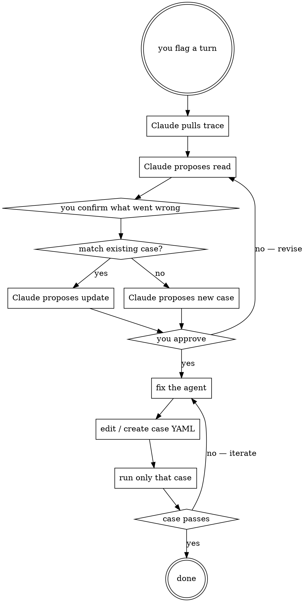

# Eval Harness — Design & Operating Manual

> **Audience:** Itamar (non-programmer owner of this app). Re-readable from scratch any time. No prior context needed.
>
> **Status:** Design doc. Not yet built. This file is the spec we'll build from.
>
> **Last updated:** 2026-05-10

---

## 1. What this is and why we're doing it

### The problem

Fantasy Copilot is an LLM-driven app. Every time we change a prompt, add a tool, or tweak a tool's logic, the agent's behavior can shift in ways we won't notice until a user hits the bug.

Today the only QA we have is: Itamar opens the chat UI, asks questions, reads answers, and pastes failures into a session with Claude. That's **manual eval**. It works once, doesn't scale, and forgets — last week's good behaviors aren't protected from next week's "fixes."

### The fix

An **eval harness** is automated quality checking for the agent. We:

1. Record real, good agent conversations (we already have them in LangSmith)
2. Promote them into structured **eval cases** — pinned to a specific point in time and league state
3. Re-run all cases automatically after every change
4. See pass/fail + diffs in seconds, not days

### Why this matters more than any single feature

Every phase we ship without this is a phase we re-test by hand. By October (live NBA season + real user pressure), we'll have far more behaviors to protect than we can manually verify. The eval suite becomes the safety net under everything else.

It's also the only way to run **real-season testing** safely. When November comes and we're tuning waiver logic against live games, we need to be sure we haven't regressed anything that worked in May.

---

## 2. Key concepts (vocabulary)

| Term | Meaning |
|------|---------|
| **Trace** | One full run of the agent: input message → tool calls → final response → tokens/latency/cost. Already stored in LangSmith. |
| **Case** | One automated test: a user message + expected agent behavior. Lives in our repo as YAML. |
| **Process eval** | Asserting on what the agent *did* (tools called, arguments, phrases avoided), not what it *said* (specific answer text). The harness is process-only. |
| **Assertion** | A check we make on the agent's output — e.g. "must call tool X", "response must mention 'continuous waivers'", "must not exceed 5 tool calls." |
| **Intent eval** | A specific assertion type: did the agent correctly understand what the user was asking? Usually checked by which tool it routed to. |
| **Run** | One full execution of all (or a subset of) cases at a moment in time. Produces a result row per case. |
| **Dataset** (LangSmith) | A LangSmith-managed collection of inputs + expected outputs. We mirror our YAML cases here so LangSmith's UI is also usable. |

---

## 3. Why LangSmith changes the design

We already have LangSmith capturing every real chat. That's a free, ongoing source of:

- The exact user message
- Every tool call and its arguments
- Every tool result
- The final agent response
- Tokens, latency, and cost per run

So we don't build a "recorder." We build a **promoter**: a tool that takes a LangSmith trace ID and converts it into a YAML eval case in our repo.

Workflow becomes:

> "I just had a good chat. Promote trace `abc123` into an eval case named 'asks_waiver_days_offseason'."

The harness fetches the trace, asks us a few questions about which assertions matter, writes the YAML, and now that conversation is a permanent regression test.

LangSmith also has its own evaluation primitives (Datasets + Experiments + scorers). We'll use them as the visualization layer alongside our own Postgres table — LangSmith's UI is great for browsing individual runs; our table is what powers the future custom dashboard.

---

## 4. How cases run — process eval, not content eval

The harness has one execution mode: **run the real agent against the live
local DB, capture what the agent did, assert on the process.**

There are no snapshots, no frozen state, no separate eval database. The
agent runs the same way it does in production. The eval validates **agent
behavior** — which tools it called, with what arguments, whether it
hallucinated forbidden phrases, whether it stayed within cost/latency budgets.
It does **not** validate the specific text of the agent's answer.

### Why process, not content

Every fantasy-copilot bug we've found or imagined reduces to one of four
shapes — and all four are testable without freezing state:

| Bug shape | How live mode catches it |
|-----------|--------------------------|
| Wrong tool called | `must_call_tools` / `must_not_call_tools` |
| Right tool, wrong arguments | `tool_call_args_contain` |
| Right calls, hallucinated synthesis | `response_contains_none` with specific never-OK phrases (e.g. "Dolphins" for the Bam Adebayo/Heat case) |
| Cost/latency drift | budget assertions (`max_tool_calls`, `max_latency_ms`, `max_cost_usd`) |

Asserting "the answer should be 41.7 fps" or "the user's rank is #2" is **not
the agent's job** — those values come from tools and the projection engine,
whose correctness is tested at the tool layer. The agent test verifies that
the agent **followed the right process** to produce the answer.

### When the agent runs

1. Runner discovers cases from `app/evals/cases/`
2. For each phrasing × repeat:
   - Generate a fresh thread_id so conversation memory doesn't leak
   - Build a config with the test user + league
   - Invoke `agent.ainvoke(...)` against the real DB
   - Capture every tool call (name + args + output preview) and the final response
3. Evaluate assertions on the captured trace
4. Report verdict per phrasing

The agent doesn't know it's in a test. Tools, prompts, LLM, projection cache —
everything is real.

### The load-bearing trick: `response_contains_none`

Because we don't assert specific content, all synthesis-level bugs ("agent said
the wrong thing") get caught via hallucination guards: phrases that should
**never** appear in a correct response. Examples:

- "Dolphins", "Cowboys", "Yankees" — NFL/MLB team names appearing in NBA context
- "I don't have", "I cannot access" — refusal patterns when the tool returned data
- "category coverage" — strategic framing wrong for points leagues

When we discover a new failure mode, the fix in eval terms is almost always
"add the offending phrase to the case's `response_contains_none` list." This
keeps the harness honest without reaching for frozen state.

### Why we don't use snapshots

We considered a `mode: snapshot` system (restore a frozen DB dump, pin
`AS_OF_DATE`, allow content-equality assertions) and decided against it. The
argument that retired the idea: every bug class we could imagine either
catches in live mode via the four shapes above, or it's a tool/engine bug
rather than an agent bug. Snapshots would have added significant machinery
(separate eval DB, capture script, restore plumbing, `EVAL_DATABASE_URL`
routing) to serve cases that don't actually exist.

If we ever discover a genuine need for frozen state later, the design is
captured in the git history at commit `ba9c7a6`. For now, all cases run live.

---

## 5. Architecture

```
┌────────────────────────────────────────────────────────────┐
│  LangSmith (already running)                               │
│  - Captures every real agent run                           │
│  - We pull traces from here to seed eval cases             │
└────────────────────────────────────────────────────────────┘
                       │
                       ▼ (promote good trace → YAML case)
┌────────────────────────────────────────────────────────────┐
│  backend/evals/                                            │
│  ├── cases/                  YAML eval cases (source of    │
│  │   ├── waiver_days.yaml    truth, version-controlled)    │
│  │   └── ...                                               │
│  ├── probes/                 Topic contracts (E4)          │
│  ├── runner/                 Python: invoke agent, check   │
│  │                           assertions, print verdicts    │
│  ├── promoter/               Python: trace → case YAML     │
│  └── reporters/              Console, JSON, Postgres       │
└────────────────────────────────────────────────────────────┘
                       │
                       ▼ (write results)
┌────────────────────────────────────────────────────────────┐
│  Postgres: eval_runs + eval_case_results tables            │
│  Source of truth for the future dashboard                  │
└────────────────────────────────────────────────────────────┘
                       │
                       ▼ (future)
┌────────────────────────────────────────────────────────────┐
│  Eval dashboard (UI)                                       │
│  - Pass rate over time                                     │
│  - Cost / latency per case                                 │
│  - Failure clustering                                      │
│  - Pass rate by intent dimension                           │
└────────────────────────────────────────────────────────────┘
```

---

## 6. Case format (the YAML spec)

Each case is one file. Plain YAML so Itamar can read and edit them.

```yaml
# evals/cases/manual/waiver_days_offseason.yaml

id: waiver_days_offseason
description: |
  User asks what their waiver days are. Agent should call get_league_rules,
  not search the web, and reference the league's waiver mechanism in plain
  English. Process-only assertions — the specific answer text varies by league.

# What the user types — either `user_message` (single) or `phrasings` (many)
phrasings:
  - "what are my waiver days"
  - "when do waivers process in my league"
  - "tell me my waiver schedule"
  - "how do waivers work here"

# Optional: prior turns to seed conversation memory
conversation_prefix: []

# Structured intent classification (used for dashboard slicing).
# Borrowed from the multi-dimensional intent taxonomy — lets us see
# "we pass 95% of definitional cases but only 70% of comparative ones."
intent:
  question_type: definitional         # definitional | procedural | comparative | conditional | recommendation | clarification_needed
  complexity: simple                  # simple | moderate | complex
  domain: rules                       # roster | waivers | trades | standings | news | rules | projections | matchups | meta
  answer_shape: explanation           # number | list | table | explanation | recommendation | clarification

# What success looks like
expected:
  # Tool routing (intent eval)
  must_call_tools:
    - get_league_rules
  must_not_call_tools:
    - search_recent_news    # this isn't a news question
    - get_free_agents

  # Response content (loose match — "any" passes if at least one hits)
  response_contains_any:
    - "continuous"
    - "daily"
    - "FAAB"

  # Response content (strict — must contain none)
  response_contains_none:
    - "I don't have"
    - "I'm not sure"
    - "I cannot"

  # Cost/efficiency
  max_tool_calls: 3
  max_latency_ms: 15000
  max_cost_usd: 0.05

# Free-form tags for additional dashboard filtering (orthogonal to `intent`).
# Use for cross-cutting concerns: "regression_8_7", "user_reported", "flaky", etc.
tags:
  - offseason
  - regression_8_7

# Where the case came from. `source: manual | promoted | generated`.
provenance:
  source: manual
  source_chat_date: 2026-05-08
```

### Intent taxonomy reference

The structured `intent` block is required on every case. Values:

| Field | Allowed values | Meaning |
|-------|---------------|---------|
| `question_type` | `definitional` | "what is X" — wants a fact or definition |
| | `procedural` | "how do I X" — wants steps |
| | `comparative` | "X vs Y" / "who's better" — wants a side-by-side judgment |
| | `conditional` | "if X then what" / "should I start him if Y" — wants reasoning under a hypothesis |
| | `recommendation` | "who should I pick up" / "what should I do" — wants an opinionated answer |
| | `clarification_needed` | The query is genuinely ambiguous; the right behavior is to ask back |
| `complexity` | `simple` | One tool, one fact, no reasoning |
| | `moderate` | 2-3 tools, light reasoning |
| | `complex` | Multi-step reasoning, multiple tools, synthesis |
| `domain` | `roster`, `waivers`, `trades`, `standings`, `news`, `rules`, `projections`, `matchups`, `meta` | Subject area |
| `answer_shape` | `number`, `list`, `table`, `explanation`, `recommendation`, `clarification` | Expected output form |

**Why this matters:** the dashboard slices on these. "Comparative + complex" cases are where the agent typically struggles. Without the taxonomy, we'd see one global pass rate and miss the structural weakness.

### Special case: clarification cases

When a query is genuinely ambiguous, the *correct* behavior is to ask back, not guess. These cases use `question_type: clarification_needed` + the `must_ask_clarification` assertion:

```yaml
id: ambiguous_pronoun_no_context
intent:
  question_type: clarification_needed
  complexity: simple
  domain: meta
  answer_shape: clarification

user_message: "is he good?"
conversation_prefix: []     # no prior turns — pronoun has no referent

expected:
  must_ask_clarification: true
  clarification_must_mention_any: ["who", "which player", "do you mean"]
  must_not_call_tools: [get_player_projection, find_player, compare_players]
  max_tool_calls: 0
```

Without these tests, the agent is free to silently guess at ambiguous queries and we'd never notice the regression.

### Assertion vocabulary (v1)

All assertions check **process**, not content. Two principles:

- Assertions on what the agent **did** (tool routing + arguments + cost) — direct checks.
- Assertions on what the agent **didn't say** (hallucination guards) — `response_contains_none` with specific never-OK phrases.
- Loose-OR'd vocabulary checks (`response_contains_any` with multiple terms) are fine because they tolerate state shifts: as long as ONE of the expected terms appears, the case passes.

| Assertion | Meaning |
|-----------|---------|
| `must_call_tools` | Every tool listed must appear at least once in the trace |
| `must_not_call_tools` | None of these tools may appear |
| `must_call_tools_in_order` | These tools must appear in this exact sequence |
| `tool_call_args_contain` | Specific arguments must appear in a specific tool call |
| `response_contains_any` | At least one of these strings appears (use loose-OR'd lists like `["continuous", "daily"]` — survives data shifts) |
| `response_contains_none` | None of these strings appear (the load-bearing hallucination guard: `["Dolphins", "I don't have", "category coverage"]`) |
| `must_ask_clarification` | Agent's response must be a clarifying question, not an answer attempt |
| `clarification_must_mention_any` | If asking for clarification, at least one of these phrases must appear |
| `max_tool_calls` | Total tool calls ≤ N |
| `max_latency_ms` | End-to-end time ≤ N ms |
| `max_cost_usd` | Total cost ≤ $X |
| `min_response_chars` | Response is at least N chars (catches "ok" responses) |
| `max_response_chars` | Response is at most N chars (catches over-explaining) |

We start with these. Add more only when we need them.

### What we deliberately don't assert

- **Specific response text** (e.g. `response_contains_all: ["#2"]`, regex). Brittle against shifting data. If you find yourself wanting this, the right move is almost always to convert it into a `response_contains_none` guard ("agent must NOT say X").
- **"Is this a good answer?" via LLM judge.** Adds cost + flakiness. Only added when string matching genuinely isn't enough.
- **Specific projection numbers, ranks, FAAB balances, or counts.** These belong in tool-layer tests, not agent-layer tests.

---

## 7. Result schema (Postgres tables)

This is the data the future dashboard reads. Designed once, written from day one.

### `eval_runs` — one row per harness invocation

| Column | Type | Notes |
|--------|------|-------|
| `id` | UUID | Primary key |
| `started_at` | timestamp | When the run kicked off |
| `finished_at` | timestamp | When it completed |
| `git_sha` | text | Code version under test |
| `git_branch` | text | Branch name |
| `triggered_by` | text | "manual", "ci", "pre-commit" |
| `model` | text | LLM model used (e.g. claude-sonnet-4-6) |
| `total_cases` | int | Cases run |
| `passed` | int | Cases passed |
| `failed` | int | Cases failed |
| `errored` | int | Cases that crashed (not pass/fail) |
| `total_latency_ms` | bigint | Sum of case latencies |
| `total_cost_usd` | numeric | Sum of case costs |
| `notes` | text | Free-form note from operator |

### `eval_case_results` — one row per case per run

| Column | Type | Notes |
|--------|------|-------|
| `id` | UUID | Primary key |
| `run_id` | UUID | FK to `eval_runs` |
| `case_id` | text | The case's YAML id (e.g. "waiver_days_offseason") |
| `passed` | bool | Pass/fail |
| `errored` | bool | True if the case crashed |
| `error_message` | text | Crash reason if errored |
| `failure_reasons` | jsonb | List of failed assertions, e.g. `[{"assertion": "must_call_tools", "expected": ["get_league_rules"], "actual": []}]` |
| `tool_calls` | jsonb | Full list of tool calls + args + outputs |
| `final_response` | text | What the agent said |
| `latency_ms` | int | End-to-end |
| `tokens_in` | int | Prompt tokens |
| `tokens_out` | int | Completion tokens |
| `cost_usd` | numeric | This case's cost |
| `langsmith_trace_id` | text | LangSmith trace ID for this run (raw ID for API queries) |
| `langsmith_trace_url` | text | Link to the LangSmith trace for this run (clickable URL) |
| `langsmith_thread_id` | text | LangSmith thread ID — groups multi-turn cases into one conversation thread |
| `agent_thread_id` | text | LangGraph thread ID used in the agent's checkpointer (links to `conversations` table) |
| `intent_question_type` | text | Copied from case `intent.question_type` (definitional / procedural / comparative / conditional / recommendation / clarification_needed) |
| `intent_complexity` | text | Copied from case `intent.complexity` (simple / moderate / complex) |
| `intent_domain` | text | Copied from case `intent.domain` (roster / waivers / trades / etc.) |
| `intent_answer_shape` | text | Copied from case `intent.answer_shape` (number / list / table / etc.) |
| `tags` | text[] | Free-form tags copied from case YAML for cross-cutting filtering |

**Why intent fields are dedicated columns (not just tags):** the dashboard's most useful slices are intent-driven ("pass rate by question_type", "cost by complexity"). Dedicated indexed columns make those queries fast and the schema self-documenting. Free-form `tags` covers everything else.

### What the dashboard can show with this

- Pass rate over time (line chart, x = `started_at`, y = `passed/total`)
- Pass rate by `intent_question_type` (definitional 95% / comparative 70% — reveals where the agent struggles)
- Pass rate by `intent_complexity` (simple vs complex — shows if the agent breaks down on multi-step reasoning)
- Pass rate by `intent_domain` (waivers 90% / trades 65% — surfaces weak subject areas)
- Clarification rate — % of `clarification_needed` cases where the agent correctly asked back instead of guessing
- Cost / latency per `intent_complexity` — confirms expensive cases are actually the complex ones, not simple ones bloating
- Cost trend per run, cost per case
- Latency p50/p95 per case
- "New regressions" — cases that passed last run but failed this run
- "Flaky cases" — cases that pass and fail intermittently
- Failure clustering — which assertion fails most often across cases?

---

## 8. Lifecycle (how this is used week to week)

### Capturing new cases

1. You have a real chat with the agent.
2. It does something well (or revealingly poorly).
3. You note the LangSmith trace URL.
4. You run `python -m evals.promoter <trace_id>`.
5. The promoter pulls the trace, asks 3-5 questions in CLI:
   - "Name this case?"
   - "Which tools were essential? (suggested: ...)"
   - "Any phrases the response must contain? (auto-extract suggestions)"
   - "Any phrases it must NOT contain?"
6. Writes a draft YAML to `evals/cases/`.
7. You review and tweak the YAML by hand.
8. Commit.

The harness grows organically from real usage.

### Running the harness

```bash
# Run all cases
./scripts/eval.sh

# Run a subset by tag
./scripts/eval.sh --tag intent

# Run one case
./scripts/eval.sh --case waiver_days_offseason

# Filter by intent.domain
./scripts/eval.sh --domain waivers
```

Output (console):

```
Running 32 cases...

✅ waiver_days_offseason          (1.2s, $0.008)
✅ trade_deadline_midseason       (2.1s, $0.014)
❌ ranks_team_strength_pointslg   (3.4s, $0.021)
   - response_contains_none failed: response contained "category coverage"
   - LangSmith: https://smith.langchain.com/...
✅ ...

30 / 32 passed (94%)
Total: 47s, $0.42
Run id: 8f3a... (logged to eval_runs table)
```

A failed assertion always includes a LangSmith link so you can inspect the full trace.

### CI integration (later)

Once stable, run on every commit. Block merges that drop pass rate below threshold.

---

## 9. Phased build plan

### Phase E0 — Foundation ✅ (committed 2026-05-12, c45acbe)

- Design doc (this file)
- Pydantic schema (`app/evals/schema.py`)
- YAML loader (`app/evals/loader.py`)
- Directory tree: cases/{manual,promoted,generated}/, runner/, digests/

### Phase E1 — Live runner + first cases ✅ (committed 2026-05-12, ba9c7a6 + 23a8ef0)

- Runner loads cases, invokes the real agent against the live local DB,
  captures tool calls + final response, evaluates assertions, prints
  pass/fail to console
- Severity tiers (critical / warning) and Verdicts (🟢/🟡/🔴/💥)
- 6 cases covering: waivers, roster, standings, stat leaders, FAs, trade deadline
- **24 / 24 phrasings passing**

### Phase E1.6 — Drop snapshots (simplification) ✅ (committed 2026-05-12, 136365d)

- Removed snapshot machinery entirely: Mode enum, snapshot_id field, two
  schema validators, scripts/eval_capture_snapshot.py, snapshots dir.
- Removed `response_contains_all` + `response_matches_regex` assertions —
  content-equality belongs at the tool layer, not agent layer.
- Doc refactored across §4, §6, §7, §9, §10, §11, §12, §13 to reflect
  process-only harness.

### Phase E2 — Postgres persistence + LangSmith routing ✅ (committed 2026-05-12, 12e919a)

- `eval_runs` + `eval_case_results` tables + Alembic migration
- Runner writes results to Postgres (best-effort, never blocks console output)
- Each result row carries `langsmith_trace_id` + `langsmith_trace_url` so a
  failing row → trace inspection in two clicks
- LANGSMITH_PROJECT=fantasy-copilot-evals env override at runner startup so
  eval traces don't pollute the prod chat project
- Verified: 37 phrasings across 10 cases persisted with full lineage

### Phase E2.1 — 4 more cases (broader coverage) ✅ (committed 2026-05-12, 5dd5e72)

- clarification_pronoun_no_context, news_status_explicit, compare_two_players,
  team_strength_weakness
- Total suite: 10 cases / 37 phrasings, all 🟢

### Phase E2.2 — eval_stats.py read-only CLI ✅ (committed 2026-05-12, b44cbe5)

- Synchronous CLI that queries eval_runs + eval_case_results
- Sections: suite health, recent runs, slices by intent dimension, slow
  phrasings, top failure modes. Foundation for the future dashboard.

### Phase 8.8 — Prompt tweak from harness signal ✅ (committed 2026-05-12, 5bfb6f9)

- Caught by E2 harness: agent fired search_recent_news 3× on one FA list
  question. Prompt fix: ≤2 news searches per turn, trust DB-side status
  fields, healthy-first FA framing.
- Case fix: expanded vocab list, tightened max_tool_calls budget.
- BACKLOG.md created with injury_status table design for future phase.

### Phase E3 — LangSmith trace fetcher (~½ session) — ENABLES §15 LOOP

- `scripts/inspect_trace.py <trace_id_or_url>` reads via langsmith SDK
- Prints user message, every tool call + args + result, final response,
  tokens, latency in a human-readable format
- This is the foundation of the §15 bad-chat triage loop — without it,
  Claude can't autonomously read what went wrong in a real chat

### Phase E4 — Seed-coverage case batch (1 session, in collaboration with Itamar) — **the suite-broadening pass**

- Walk every intent cluster in §13 (Roster, Standings, Stat leaders, FAs,
  Trades, Projections, Schedule, News, Team strength, League rules,
  Multi-turn, Clarification, Edge cases, Adversarial)
- For each, Claude proposes 1–3 cases; Itamar approves; case lands
- Target: ~40–60 additional cases, bringing the suite from 10 → 50+
- Verified via per-case runs as we go; full sweep at the end

### Phase E5 — Admin gate (½ session)

- `ADMIN_EMAILS` env var
- `is_admin` derived field on `get_current_user` dependency
- Decorator / dependency `require_admin` for sensitive routes
- Migrates `/leagues/debug-sync` to use it too (CLAUDE.md hardening item)

### Phase E6 — Dashboard backend (1 session)

- New admin-gated routes under `/api/admin/evals/*` (cases, runs, run-by-id,
  case-history, trigger-run, job-status, slices)
- The trigger route kicks off the runner in a background task and writes
  results to `eval_runs` as usual
- Job status polled via short-lived `jobs` table or in-memory dict

### Phase E7 — Dashboard frontend (1 session)

- Next.js `/eval` route, admin-only (404 for non-admins)
- Sidebar tab conditionally rendered for admins
- Six views from §16: headline health, recent runs, case library, trigger
  surface, slices charts, failure clusters

### Phase E8 (later) — Cron + weekly digest

- Only when case count grows past ~100
- Nightly full-suite cron + weekly digest in `app/evals/digests/{date}.md`
- Hard alerts on pass-rate drop > 5% or new errored case

---

## 10. What this catches vs doesn't (calibrate expectations)

### Catches well

- **Wrong tool routing** — via `must_call_tools` / `must_not_call_tools`
- **Wrong tool arguments** — via `tool_call_args_contain`
- **Hallucinated phrases** ("Adebayo plays for the Dolphins") — via `response_contains_none`
- **Strategy framing regressions** ("category coverage" in a points league) — via `response_contains_none`
- **Cost / latency / over-tool-use regressions** — via budget assertions
- **Tool-not-called-when-needed** — agent answering "what are my waiver days" from training data instead of calling the tool
- **Ambiguous-query handling** — via `must_ask_clarification` (agent shouldn't guess)

### Catches partially

- **Quality of writing** — only via length bounds and key-phrase presence. Doesn't judge prose.
- **Recommendation correctness** — we can check the agent called the right tools and didn't hallucinate, but "is this the right trade?" is judgment, not a test.

### Doesn't catch

- **Novel failures** — only catches regressions of behaviors we've encoded.
- **Tone / personality** — needs LLM-as-judge, deferred until needed.
- **End-to-end UI bugs** — this tests the agent, not the chat UI rendering.
- **Specific factual values** (rank, FPS, FAAB balance, schedule counts) — these belong in tool-layer tests. The agent layer only verifies the agent followed the right process to expose those values.

---

## 11. Open decisions (things we'll figure out as we build)

- **LangSmith Datasets vs our YAML — which is source of truth?** YAML in repo. LangSmith Dataset is a mirror, regenerated from YAML on each run.
- **Run frequency?** Manual at first (after big changes). CI integration once it's stable and fast.
- **LLM-as-judge scoring?** Deferred. Add only when a class of failure can't be checked with string matching.

### Resolved (2026-05-10)

- ~~Manual case authoring vs automated generation~~ → **Hybrid.** Generated covers behavior at scale, promoted covers high-value real-chat cases. See §13.
- ~~Should the same model author and run cases?~~ → **No.** Author = Opus, agent under test = Sonnet, to break self-reference bias.
- ~~Zero-monitoring vs full-monitoring~~ → **Weekly digest** is the floor. ~5 min/week of human attention. See §13.

### Resolved (2026-05-12)

- ~~Do we need snapshots / frozen DB state?~~ → **No.** Every bug class we could imagine reduces to wrong-tool, wrong-args, or hallucinated synthesis — all catchable in live mode against shifting data. Snapshots would have added significant machinery (separate eval DB, capture script, `EVAL_DATABASE_URL` plumbing) for use cases that don't exist. The harness is **live-only**. See §4.
- ~~Are content-equality assertions (`response_contains_all`, `response_matches_regex`) ever useful?~~ → **No.** Removed from the vocabulary entirely. The agent test verifies process, not specific content. Hallucination guards via `response_contains_none` handle synthesis-level bugs without needing frozen state.
- ~~Where does ground truth come from for generated cases?~~ → **From the topic contract**, not from DB queries. Each topic hard-codes: which tool(s) the agent must call, what vocabulary the response should reference, what phrases must NEVER appear. See §13.

---

## 12. Glossary cross-reference

If you forget what a word means, search this file:

- "Trace" → §2
- "Case" → §2, §6
- "Process eval" → §4
- "Hallucination guard" (`response_contains_none`) → §4, §6
- "Assertion" → §2, §6
- "Verdict (PASS / SOFT_PASS / FAIL)" → §6
- "Severity (critical / warning)" → §6
- "Intent eval" → §2, §6
- "Run" → §2, §7
- "LangSmith Dataset" → §2, §3
- "Topic contract" → §13

---

## 13. Where cases come from — Claude as case author

Cases enter the suite through two pathways:

| Pathway | When | Volume | Cadence |
|---------|------|--------|---------|
| **Seed coverage** | Claude thinks hard about every user intent and writes cases for them upfront | ~50–80 cases by end of seeding | Done in batches across a few sessions |
| **Triage cases** | A real chat surfaces a behavior we hadn't tested. Claude proposes a new case (or an update to an existing one) following the §15 loop | ~1–3 per real bug surfaced | Reactive, organic |

Both pathways are **written by Claude, approved by Itamar**. No standalone
generator service, no separate Opus pipeline, no skill machinery. The
authoring happens inside the normal Claude Code conversation — Claude
proposes the YAML, Itamar approves the diff, the case lands. The author
*is* the assistant.

### Self-reference mitigation, the simple version

The original design called for a separate Opus pipeline to paraphrase cases
so that the "author model" differed from the "agent model" (Sonnet). After
the §4 / §15 simplifications, that machinery is gone. The remaining
mitigations against author/agent blind-spot alignment are:

1. **Human gate.** Itamar approves every case before it lands. The eval
   suite is a contract Itamar signs off on, not a Claude-only artifact.
2. **Diverse phrasings per case.** Each case carries 3–5 paraphrasings —
   terse vs verbose, jargon vs plain English, fragments vs full sentences.
   If Claude has a phrasing-shape blind spot, the paraphrasings expose it.
3. **Real-chat triage** (§15). Cases that come from real failed chats are
   grounded in *user* language, not Claude's idea of user language. As the
   triage flow runs, the suite drifts toward real-world distribution.

### What seed coverage looks like

Claude's job, across a few seeding sessions, is to think through every
distinct user intent a fantasy-NBA copilot user would naturally have, and
write a case for it. Examples of intent clusters Claude should walk through:

| Cluster | Sample intents |
|---------|----------------|
| **Roster** | "show me my roster", "who's on team X" |
| **Standings** | "what's my rank", "league leader by points_for" |
| **Stat leaders** | "top in rebounds", "best assists per game last 30 days" |
| **Free agents / waivers** | "best FAs", "should I pick up X", waiver day mechanics, FAAB balance, max adds |
| **Trades** | "compare A and B for trade", "trade deadline", "trade ratify rules" |
| **Projections** | "project X this week", "highest projected FA", "best per-game vs season-total" |
| **Matchups / schedule** | "who has the most games this week", "back-to-back load" |
| **News / status** | "any news on X", "is X playing tonight", "when's X back" |
| **Team strength** | "where am I weak", "what does my team need" (points-league framing!) |
| **League rules / meta** | "how does FAAB work", "playoff bracket", "draft type" |
| **Multi-turn flows** | pronoun resolution, topic switching, "and second?" follow-ups |
| **Clarification cases** | ambiguous queries that SHOULD trigger ask-back behavior |
| **Edge cases** | empty roster (new user), off-season behavior, traded players, two-way contracts |
| **Adversarial** | NFL-team-name traps (MIA / NYK / DAL), category framing in a points league |

For each intent, Claude writes the YAML following the §6 spec and the
process-only assertion rules (§4, §6). Each case carries 3–5 phrasings, a
realistic intent classification, the right tool routing, a vocabulary
guard, and a hallucination blacklist.

### Process-only assertions (recap)

What every Claude-authored case can use:

- `must_call_tools` — tools the agent must call for this intent
- `must_not_call_tools` — tools that would signal misrouting
- `response_contains_any` — loose-OR'd vocabulary (`["continuous", "daily", "FAAB"]` — at least one)
- `response_contains_none` — never-OK phrases (load-bearing hallucination guard)
- `must_ask_clarification` — for ambiguous queries the agent should ask back on
- Cost / latency / length budgets

What cases never use:

- Specific numerical values (rank, FPS, FAAB balance)
- Specific player names as a required answer
- Exact text matches

If a case calls for one of those, the right move is to convert it into a
hallucination guard or move the assertion down to the tool layer (§10).

### Repeat / phrasings / multi-turn (still supported)

The schema supports three reliability dimensions:

```yaml
# Paraphrase robustness
phrasings:
  - "what are my waiver days"
  - "when do waivers process"
  - "tell me my waiver schedule"
  - "claim window?"

# Flakiness detection — run each phrasing M times, expect 100% pass
repeat: 3

# Multi-turn / memory — prior turns seeded before the test message
conversation_prefix:
  - role: user
    content: "show me my roster"
  - role: assistant
    content: "Here's your roster: ..."
```

Each phrasing × repeat = one row in `eval_case_results`. So a case with
4 phrasings and repeat=3 produces 12 result rows. The dashboard rolls them
up to per-case pass rate.

### Monitoring

We don't run cron sweeps in v1. The §15 workflow keeps cases fresh
case-by-case. Full-suite runs happen on Itamar's command. The dashboard
(§16) gives at-a-glance health when Itamar wants to check.

We can add cron + a weekly digest later if the case count grows beyond
what casual sweeps can cover (probably >100). For now, on-demand is the
right cadence and matches the cost policy (§14).

### What's NOT in this section anymore

Earlier drafts of this doc described a standalone `eval-author` skill —
a slash-command pipeline that loaded a Python "topic contract" module,
ran Opus to paraphrase prompts, dry-ran the generated cases, and
auto-committed them. We removed that machinery because:

1. The §15 triage loop covers the "wide net" use case organically — every
   real bug becomes a case, and Claude can also seed broad intents in
   batches without standalone machinery.
2. The topic-contract abstraction was solving a problem (separating
   generator from agent) that the human-approval gate already solves.
3. One fewer subsystem to maintain. Cases stay close to the rest of the
   codebase, edited the same way as any other YAML.

If we ever want to generate hundreds of cases per topic in a single batch,
we can revive the idea. Until then, hand-authoring (by Claude, approved by
Itamar) is the right shape.

---

## 14. Cost policy

Running evals costs LLM tokens. Without a policy this grows quietly until the
bill is uncomfortable. This section locks in the discipline.

### Cost components

| Component | Cost behavior |
|-----------|---------------|
| LLM (Anthropic Sonnet for agent under test) | Dominant. ~$0.005–$0.025 per agent run, prompt-cache dependent |
| LLM (Anthropic Opus for `eval-author` generation) | Paid only when generating cases, not when running |
| LangSmith ingestion | Free at our volume |
| Tavily (`search_recent_news`) | Real Tavily calls cost cents per query. Cases generally avoid it via `must_not_call_tools: [search_recent_news]`; when a news-status case genuinely needs it, accept the small per-call cost. |
| Postgres + local compute | Free |

**Prompt caching is the key lever.** The system prompt + tool definitions
(~3-4k tokens) are identical across every case. Deepagents caches by default —
after the first run in a batch, subsequent runs pay ~10% on the cached portion.
**Run cases in batches**, not one-at-a-time, to keep the cache warm.

### Projected cost per full-suite run

Assumes prompt caching on, no Tavily calls, Sonnet pricing.

| Stage | Cases | Avg phrasings × repeats | Runs | Cost / full suite |
|-------|-------|------------------------|------|-------------------|
| E1 launch ✅ | 6 | 4 × 1 | 24 | ~$0.30 (measured) |
| After E4 (first generated batch) | ~30 | 3 × 1 | 90 | ~$0.50–$1 |
| 3 months out | ~100 | 3 × 1 | 300 | ~$2–$3 |
| Mature suite (6+ months) | ~300 | 3 × 1.5 | ~1,400 | ~$10–$15 |

A single full-suite run is between pennies and ~$15 at maturity.

### Tiered run policy

The cost question is really "how often do we run it." The answer is:
not on every commit. Tier by risk and frequency.

| Tier | When | What runs | Mature cost / day | Why |
|------|------|-----------|-------------------|-----|
| **Smoke** | On every commit (CI, later) | Hand-picked subset (~5–10 cases) covering highest-risk paths | Pennies | Catches the worst regressions in 30s. Most commits don't touch agent behavior; full suite is wasted. |
| **Domain-filtered** | During active development | `eval.sh --domain waivers` if you're working on waivers | ~$0.50 / run | Tight feedback loop, no need to run unrelated cases |
| **Full suite** | Nightly cron + on-demand before any agent/prompt change merges to main | All cases × all phrasings × repeat | ~$10–$15 / day | Safety net. Produces the data feeding the weekly digest. |
| **Flakiness sweep** | Manual, ad-hoc when a case is suspected flaky | One case × phrasings × repeat=10 | ~$1 / sweep | Targeted diagnosis, not part of standard cadence |

### Levers if costs grow uncomfortable

- **Repeat=1 by default.** Increase only on cases under flakiness investigation.
- **Skip `generated/` cases on smoke tier**, run them only nightly. `promoted/` and `manual/` (curated, high-value) stay on smoke.
- **Per-domain smoke selection**: keep 1–2 representative cases per intent.domain on the smoke tier; the rest only nightly.
- **Skip generated cases that aren't currently exercised.** If a topic's feature isn't shipping yet, mark those cases inactive instead of running them on every cron.
- **Stop running cases with `repeat>1`** when investigation completes — flakiness sweeps are scoped, not standing.

### What NOT to do (anti-patterns)

- **Don't substitute Haiku for the agent under test.** The eval must hit the real production model. Cheaper-model evals lie.
- **Don't disable evals because they cost.** A missed regression in production costs more than running the suite. The threshold for "too expensive" is when token spend crosses ~5% of total LLM spend; well below that, keep running.
- **Don't run on every commit assuming it's "free."** Caching helps but doesn't eliminate cost. Multiply commits/day × full-suite cost before flipping that switch.

### When to revisit this section

- When `eval_runs` token spend in a month exceeds 5% of total Anthropic spend
- When mature-suite cost projection exceeds $50/day
- When the smoke tier grows past ~15 cases (it shouldn't; trim it)
- When we add expensive-per-call tools (e.g. real-time NBA APIs) that bypass the standard tool cost profile

---

## 15. Working with the harness day-to-day

This section describes how the eval harness *actually* gets used between
Itamar and Claude Code. It's the operating manual — read this if you forget
how the loop works.

### Two activities, very different cadences

| Activity | When | How often |
|----------|------|-----------|
| **Triage a bad chat** | A specific agent turn went wrong | Reactive — every time you spot one |
| **Full-suite sweep** | You want a health check or pre-merge confidence | On your explicit command, e.g. "run the full suite" |

Every other change to the agent (prompts, tools, etc.) only re-runs the
**case(s) related to that change**. We never auto-run the full suite. Cost
discipline (§14) demands surgical runs as the default.

### Loop 1 — Triage a bad chat

This is the most important workflow. It's how the harness grows organically
from real usage.



#### Step-by-step

1. **You flag it.** Either paste a LangSmith URL, paste a chat snippet, or
   describe the failure ("the agent said X was on the 76ers but he's been
   on the Knicks since the trade").

2. **Claude pulls the trace.** Using `scripts/inspect_trace.py <trace_id>`
   which reads via the LangSmith SDK (your `LANGSMITH_API_KEY` from `.env`).
   The script prints: user message, every tool call + args + result, final
   response, tokens, latency. Claude does NOT need you to copy/paste any of
   this — autonomous access.

3. **Claude proposes a read** of what went wrong. Be specific: "the agent
   called `search_recent_news` 3 times when one would have sufficed" or
   "the agent claimed Smith is on PHI when `find_player` returned NYK".

4. **You confirm or correct.** If Claude's read is wrong (it sometimes
   will be — traces don't always show intent), you set them straight.

5. **Claude searches the case library.** Looks for a YAML whose intent
   shape (domain × question_type × answer_shape) and `must_call_tools` /
   `phrasings` match this scenario. Claude tells you:
   - "Closest match: `top_free_agents` — but it doesn't cover the
     positional-surplus case", OR
   - "No existing case covers this — I'll create one"

6. **You approve the path.** Claude never silently edits a case or makes
   one up. Approval is explicit.

7. **Fix the agent first, case second.** The case should encode "what
   correct behavior looks like AFTER the fix", not "what the agent
   currently does." So we fix the prompt/tool/etc. first, then write the
   assertions that capture the corrected behavior.

8. **Run only that case** to verify. `python scripts/run_evals.py --case
   <id>`. Pennies, ~30 seconds.

9. **If it passes, we're done.** If it doesn't, iterate on the fix or the
   assertions. We do NOT touch the case to make it pass — the case is the
   spec, the agent is the implementation.

### Loop 2 — Full-suite sweep

Triggered on your explicit command. Examples:
- "run the full suite" — before a meaningful merge
- "are we still green" — health check after several small changes
- Nightly cron later (Phase 8 of cost policy §14)

Cost: $0.30–$1 per sweep today, scaling to ~$15 at the mature suite. See §14.

### What Claude does autonomously vs with your approval

| Action | Autonomous? |
|--------|-------------|
| Pull a LangSmith trace + summarize | ✅ |
| Search YAML library for matching cases | ✅ |
| Propose a case update or new case | ✅ |
| **Edit or create a case YAML** | ❌ — needs your approval |
| **Edit the agent prompt / tools** | ❌ — needs your approval |
| Run a single case for verification | ✅ |
| Run the full suite | ❌ — your command |
| Persist results to Postgres | ✅ |
| Add an entry to BACKLOG.md | ✅ |

### Why this works

The harness is most valuable when **the gap between "user flagged a bug" and
"that bug is permanently locked in as a regression test" closes from days to
minutes.** This loop is what closes that gap.

Real example from this build (2026-05-12): the harness caught the agent
firing `search_recent_news` 3 times for one FA list question. We fixed the
prompt (Phase 8.8), tightened the case's `max_tool_calls` budget from 4 to 3,
expanded the vocabulary list, and added the failure pattern to BACKLOG.md as
the seed for the future injury_status pipeline. From flag to locked-in fix:
~20 minutes in-conversation.

### Things to never do in this loop

- **Never tune the case to match a buggy agent.** The case is the spec.
- **Never run the full suite "to be safe" without explicit ask.** Cost.
- **Never silently delete a failing case.** Failures are signal.
- **Never edit a generated case in `cases/generated/`.** If a generated case
  is wrong, fix the topic contract (§13) and regenerate.

---

## 16. Dashboard + admin gating

The eval harness produces queryable data. The dashboard turns that into a
single page you can glance at — and trigger runs from — without dropping
into psql or the CLI.

### Where it lives

**Same Next.js frontend as the chat app**, on a new `/eval` route. Same
auth, same deployment. Hidden from non-admin users entirely.

This is the right call because:
- One codebase, one deploy pipeline
- The auth (JWT in HTTP-only cookies) already works — we just check who's
  asking before serving the route
- When friends use the app, the eval surface is invisible to them — the
  route 404s, the API returns 403, the sidebar tab doesn't render
- Adding a new admin later = one line in an env var

### Admin model

**Cheapest path: an `ADMIN_EMAILS` env var.**

```env
ADMIN_EMAILS=itamarsaacks1@gmail.com
```

Comma-separated emails. The backend's `get_current_user` dependency
exposes a derived `is_admin: bool` based on whether the requesting user's
Yahoo OAuth email is in this list.

Admin-gated routes:
- All `/api/admin/*` endpoints (already planned for the `/leagues/debug-sync`
  hardening per CLAUDE.md)
- All `/api/evals/*` endpoints (this section)

Non-admins hitting these routes get a 403 with `{detail: "admin only"}`.

When you grow past "just me" — e.g. you find a co-builder — you add their
email to the env var. No DB migration, no UI changes. Later, if you want
formal user roles + a UI for managing them, we promote to an `is_admin`
column on `users` and migrate. Not needed today.

### What the dashboard shows

Six views, in priority order. Each maps to a known-useful query against
`eval_runs` / `eval_case_results`.

1. **Headline health** (top of page)
   - Last run: pass rate as a big number + 🟢/🟡/🔴/💥 verdict counts
   - Trend sparkline: pass rate over the last 20 runs
   - Last-run cost + duration

2. **Recent runs** (table)
   - id, started_at, total/pass/soft/fail/errored counts, duration, cost,
     branch, notes — sortable, last 50 rows
   - Click a row → drill into per-phrasing results for that run

3. **Case library** (table)
   - One row per YAML in `cases/manual` + `cases/generated`
   - Columns: case_id, intent dimensions, tags, last-run verdict, last-run
     latency, "trigger" button
   - Filter by domain / question_type / complexity / tag
   - Click → see the YAML rendered + last 10 runs of that case

4. **Trigger a run** (the action surface)
   - Multi-select cases from the library
   - "Run selected" button → fires `POST /api/evals/run`
   - Status polled every 2s until the background job writes the result row
   - Result table updates in place; row click drills in

5. **Slices** (charts, kept simple)
   - Pass rate by `intent_domain` — bar chart
   - Pass rate by `intent_complexity` — bar chart
   - Pass rate by `intent_question_type` — bar chart
   - Cost trend — line chart, last 30 runs

6. **Failure clusters** (table)
   - Top assertions by failure count + severity
   - Click → see all failing cases for that assertion

Deliberately **not** in v1:
- LLM-as-judge scoring (cost + flakiness)
- Per-tag dashboards beyond the slice charts
- Comparative dashboards across LangSmith projects
- Anything fancier than the above. Keep the surface tight.

### Backend API (new routes, all admin-gated)

```
GET  /api/admin/evals/cases               # case library, joined with last verdict
GET  /api/admin/evals/runs?limit=50       # recent runs
GET  /api/admin/evals/runs/{id}           # one run + all its case results
GET  /api/admin/evals/cases/{id}/history  # last 10 runs of one case
POST /api/admin/evals/run                 # body: {case_ids: [...]}, kicks off job
GET  /api/admin/evals/jobs/{job_id}       # status / progress of a triggered run
GET  /api/admin/evals/slices/{dim}        # data for the chart views
```

The trigger endpoint kicks off the runner in a background task — APScheduler
or a simple `asyncio.create_task` would work. The job writes to `eval_runs`
as usual. The dashboard polls `/jobs/{id}` until done.

### What friends see when the app is public

| Surface | You (admin) | Friend |
|---------|-------------|--------|
| Chat tab | ✅ | ✅ |
| Their own roster, league, etc. | ✅ (yours) | ✅ (theirs) |
| Sidebar "Evals" tab | ✅ | (not rendered) |
| `/eval` page | ✅ | 404 |
| Trigger a run | ✅ | (button absent) |
| `/api/admin/evals/*` | 200 | 403 |
| LangSmith UI | ✅ (your account) | ❌ |

Friends just see a chat app. The eval data flows in passively from their
usage — their conversations show up in the LangSmith `fantasy-copilot-v2`
project, and when you spot something interesting you flag it to Claude
(Loop 1 in §15).

### What's NOT in the dashboard plan

- **User feedback button** (👍/👎 on each agent response). Real users
  giving real signal is valuable, but it's a separate feature targeted at
  the chat UI for everyone, not the eval surface for admins. Tracked in
  `docs/BACKLOG.md`.
- **Triggering runs against snapshots.** We don't have snapshots (§4). If
  we ever bring them back, this becomes "pick a snapshot + cases".
- **Editing cases from the UI.** Cases are version-controlled YAML — they
  should be edited via PR, not via a dashboard. Approving changes through
  git review is part of the workflow safety.

### Phasing

The dashboard slots in as Phase E5 (replacing the old "dashboard" placeholder
in §9). E4 below it becomes "broaden case coverage" — Claude generates more
cases by hand, you and Claude co-improve them as bugs surface (per §15).

---

## How to keep this doc useful

- Update §11 (Resolved) every time a major open decision lands.
- Update §6 (assertion vocabulary) every time we add an assertion type.
- Don't delete the "deferred" or "open decisions" sections — they're reminders of things we chose NOT to do, which matters as much as what we did.
